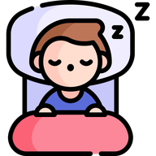
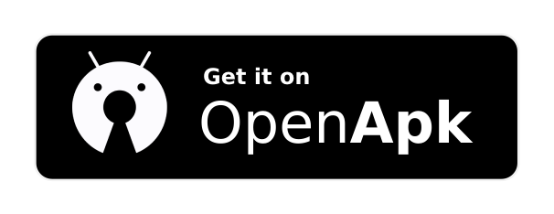
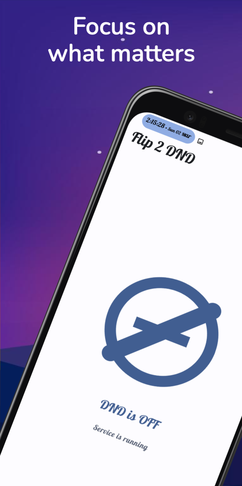
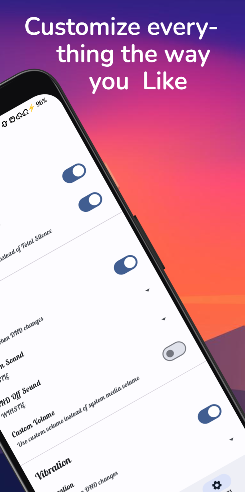
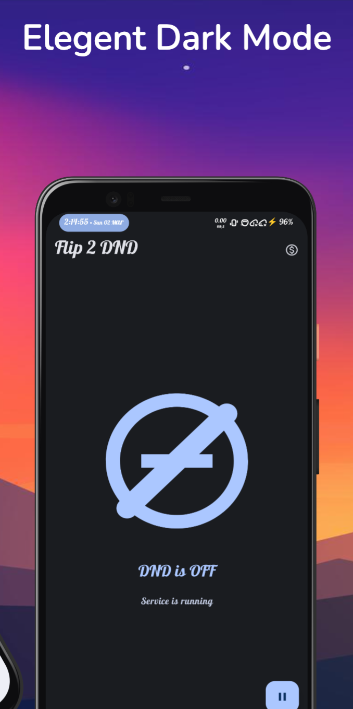
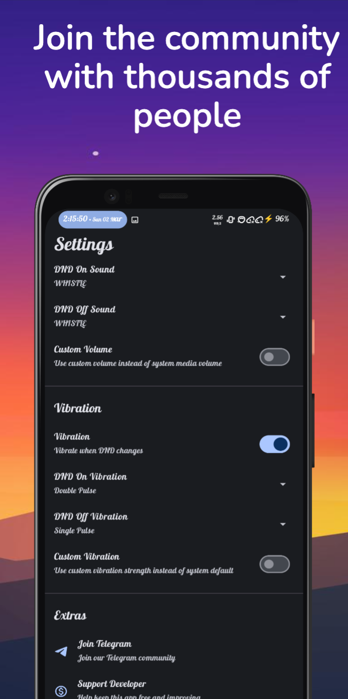

# Flip 2 DND

<p align="center">
  
  <br>
  <b>A modern, open-source Android utility to automate your focus.</b>
</p>

<p align="center">
  
  
  
</p>

---

## 📖 Overview

**Flip 2 DND** is a minimalist and intelligent Android application designed to enhance your productivity and peace of mind. By leveraging your device's orientation sensors, it automatically toggles **Do Not Disturb (DND)** mode based on physical movement.

Simply **flip your phone face down** to silence notifications and stay focused. **Flip it back up** to return to your normal state. It's seamless, intuitive, and respects your privacy.

---

## 🚀 Key Features

- 🔄 **Intelligent Flip Detection**: Automatically toggles DND mode based on phone orientation.
- ⏱️ **Activation Delay**: Configure timing (2 seconds in Free, 0-10 seconds in Pro).
- 🔋 **Battery Saver Integration**: Automatically enable Battery Saver when flipped (Requires ADB permission).
- 🎨 **Modern Material 3 UI**: Built with Jetpack Compose, featuring a clean interface and dynamic "Material You" theming.
- 🔔 **Custom Feedback**: Personalize your experience with custom vibration patterns and sound notifications.
- 📅 **Advanced Scheduling (Pro)**: Set DND, Sound, and Vibration schedules for different times and days.
- 📁 **Custom Sound (Pro)**: Use any sound file from your device for DND notifications.
- 🚀 **Auto Start (Pro)**: Service starts automatically after device reboot.
- 🔋 **Battery Saver Sync (Pro)**: Automatically enable Battery Saver when flipped (Requires ADB permission).
- 🔍 **DND Cancellation Filters (Pro)**: Prevent DND activation when flashlight is on, media is playing, or headphones are connected.
- 🌑 **Dark Mode Support**: Fully optimized for both light and dark themes.
- 🛠️ **Quick Settings Tile**: Control the service directly from your notification shade.
- 🔒 **Privacy Focused**: No tracking, no ads, and minimal permissions.

---

## 💎 Flip 2 DND Pro

Get the most out of Flip 2 DND by upgrading to Pro!

- **Auto Start on Boot**: Never manualy start the service again.
- **Advanced Sensitivity**: High sensitivity mode for better detection.
- **Full Delay Customization**: Set your preferred activation delay precisely.
- **Custom Sound Support**: Choose your own notification sounds from your file system.
- **Full Automation Schedules**: Automate DND, Sound, and Vibration states based on your daily routine.
- **Battery Saver Integration**: Automatically enable Battery Saver when flipped.
- **DND Cancellation Filters**: Flashlight, Media, and Headphone detection.

<p align="center">
  <a href="https://robinsrk.gumroad.com/l/flip_2_dnd">
    
  </a>
</p>

---

## ⚖️ Free vs Pro Comparison

| Feature                | Free | Pro |
| :--------------------- | :--: | :-: |
| **Advanced Schedules** |  ❌  | ✅  |
| **Battery Saver Sync** |  ❌  | ✅  |
| **Detection Filters**  |  ❌  | ✅  |

---

## 📥 Installation

Choose your preferred platform to download the latest version:

<p align="center">
  <a href="https://robinsrk.gumroad.com/l/flip_2_dnd">
    
  </a>
  <a href="https://apt.izzysoft.de/fdroid/index/apk/dev.robin.flip_2_dnd">
    
  </a>
  <!-- <a href="https://f-droid.org/en/packages/dev.robin.flip_2_dnd/">
    
  </a> -->
  <a href="https://github.com/robinsrk/Flip_2_DND/releases/">
    
  </a>
  <a href="https://www.openapk.net/flip-2-dnd/dev.robin.flip_2_dnd/">
    
  </a>
</p>

---

## 📱 Visual Experience

<p align="center">
  
  
  
  
</p>

---

## ⚡ Battery Saver Setup (Optional)

To enable automatic Battery Saver toggling, you need to grant the `WRITE_SECURE_SETTINGS` permission via ADB:

```bash
adb shell pm grant dev.robin.flip_2_dnd android.permission.WRITE_SECURE_SETTINGS
```

---

## 📈 Growth & Support

<p align="center">
  <a href="https://star-history.com/#robinsrk/flip_2_dnd&Date">
    
  </a>
</p>

---

## 📄 License

This project is licensed under the [MIT License](LICENSE).

Built with ❤️ using **Kotlin** and **Jetpack Compose**.
